# day01 ——Java基础入门

Hello，各位小伙伴大家好，欢迎来到Java的世界，咱们正式开干！！！ 

## 一、 Java背景知识

在正式开干之前，我们先了解一下Java的背景知识，方便以后你在和大家聊Java的时候可以说到一块去。

### 1.1 Java语言的历史

- **Java是哪家公司的产品？**

  Java是美国Sun（Stanford University Network，斯坦福大学网络公司）公司在1995年推出的一门计算机**高级编程语言**。但是在2009年是Sun公司被Oracle（甲骨文）公司给收购了，所以目前Java语言是Oracle公司所有产品。

- **Java名称的来历？**

  早期这门语言的名字其实不叫Java，当时称为Oak（橡树的意思），为什么叫橡树呢？原因是因为Sun公司的门口种了很多橡树，但是后来由于商标注册时，Oak商标已经其他公司注册了，所以后面改名为Java了。那么有人好奇为什么叫Java呢？Java是印度的一个岛屿，上面盛产咖啡，可能是因为他们公司的程序员喜欢喝咖啡，所以就改名为Java了。

- **Java的创始人是谁？**

- 说完Java名称的来历之后，接下来我们聊聊Java的祖师爷是谁？ Java的联合创始人有很多，但是行业普遍认可的Java的创始人 是**詹姆斯●高斯林**，被称为Java之父


### 1.2 Java能做什么

了解了Java语言的历史之后，接下来，大家比较关心的问题可能是Java到底能做什么了？

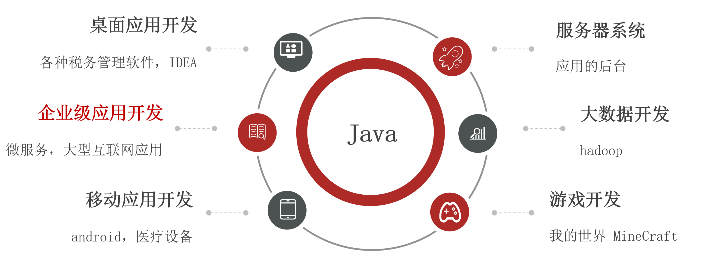

其实Java能做的事情非常多，它可以做桌面应用的开发、企业互联网应用开发、移动应用开发、服务器系统开发、大数据开发、游戏开发等等。

```java
1.桌面应用开发：能够在电脑桌面运行的软件
	举例：财务管理软件、编写程序用的IDEA开发工具等，可以用Java语言开发
	
2.企业级应用开发：大型的互联网应用程序
	举例：淘宝、京东、大家每天都用的tlias教学管理系统等

3.移动应用开发：运行的Android手机端的软件
	举例：QQ客户端、抖音APP等

4.服务器系统：应用程序的后台（为客户端程序提供数据）
	举例：服务器系统为用户推荐那你喜爱的视频

5.大数据开发：大数据是一个互联网开发方向
	举例：目前最火的大数据开发平台是Hadoop，就是用Java语言开发的

6.游戏开发：游戏本质上是给用户提供娱乐的软件，有良好的交互感受
	举例：我的世界MineCraft就是用Java语言开发的
```

虽然Java能做的事情非常多，但并不是每一个方向都被市场认可（比如桌面应用使用Java语言开发就不太方便，而使用C#语言是比较推荐的）。**目前Java的主流开发方向是使用Java开发企业级互联网应用程序**（很多公司的OA系统，客户关系管理系统，包括传智播客使用教学实施管理系统都是用Java语言开发的）


### 1.3 Java的技术体系

说完Java语言能做什么之后，接下来我们再给同学们介绍一下Java的技术体系。所谓技术体系，就是Java为了满足不同的应用场景提供了不同的技术版本，主要有三个版本。

- Java SE（Java Standard Edition）：叫做标准版，它是后面两个版本的基础，也就是学习后面两个版本必须先学习JavaSE。**我们基础班现阶段学习的就是这个版本中的技术**。

- Java EE（Java Enterprise Edition）: 叫做企业版，它是为企业级应用开发提供的一套解决方案。**在后面就业班课程中主要学习这个版本中的技术**。
- Java ME（Java Micro Edition）：叫做小型版，它为开发移动设备的应用提供了一套解决方案。**目前已经不被市场认可（淘汰），取而代之的是基于Android系统的应用开发**。

---


Java语言的相关背景就给大家介绍到这里了，这些内容小伙伴们也不用刻意去记，简单了解一下就可以了。下面我们在简要回顾一下

```java
1.Java是什么？
	答：Java是一门高级编程语言
	
2.Java是哪家公司的产品？
	答：Java以前是Sun公司的产品，现在Java是属于Oracle公司的产品
	
3.Java之父是谁？
	答：詹姆斯●高斯林
	
4.Java主流的开发方向是什么？
	答：企业级互联网应用开发
	
5.Java技术平台有哪些？
	答：JavaSE（标准版）、JavaEE（企业版）、JavaME（小型版）
```


## 二、 Java快速入门

上一章我们给小伙伴们介绍了Java的相关背景，你们现在是不是就想马上用一下Java呀？先不着急，我们得先得安装Java的开发环境，才能使用Java语言开发程序（ps: 就像你先需要安装微信，才能使用微信和朋友聊天是一样的）。

这里所说的Java开发环境，实际上就是Java官方提供的一个软件，叫做JDK（全称是Java Develop Kit），翻译过来意思就是Java开发工具包。**我们先要到官网上去下载JDK，然后安装在自己的电脑上，才可以在自己的电脑上使用JDK来开发Java程序**

JDK的版本有很多，下图是JDK版本更新的历程图，有LTS标识的是长期支持版本（意思就是Oracle会不定期更新）。目前公司中用得最多的版本是JDK8版本，在目前这套课程中我们为了将一些新特性会使用JDK17版本。

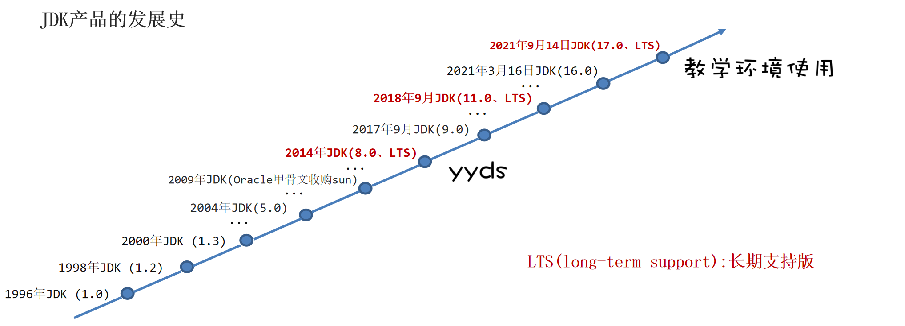


下面已经给小伙伴们提供了详细的JDK下载和安装过程的截图，大家只需要按照步骤操作就行。

### 2.1 JDK下载和安装

- **JDK的下载**

这是JDK下载的官方网址 https://www.oracle.com/java/technologies/downloads/，你需要把该网址复制到浏览器的地址栏，敲回车


进入网址后，选择JDK17版本，找到Windows标签，选择x64 Installer版本。如下图所示

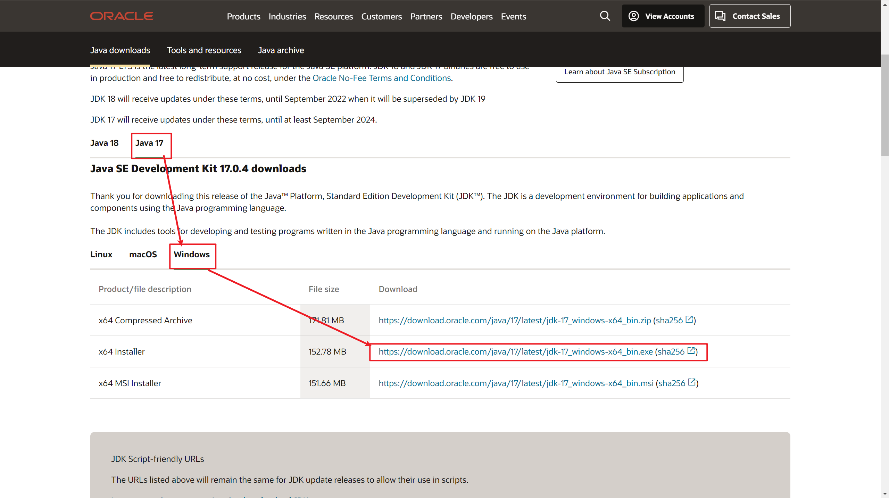

下载完成之后，在你下载的目录下会出现一个JDK的安装包，如下图所示


到这JDK的下载就完成了，接下来就需要按照下面的步骤完成JDK安装.

-  **JDK的安装**

双击安装包，按照下图引导，点击下一步即可安装。**需要注意的是安装JDK后不像你安装QQ一样会在桌面上显示一个图标，JDK安装后桌面上没有图标！！！**


**如何验证安装成功了呢？**

刚才不是让你记住安装目录吗？你记住了吗？如果你自己修改过目录，就打开你自己修改的目录（呀！！忘记了o(╥﹏╥)o，那我帮不了你了，谁让你不认真听讲的）；如果没有修改安装目录，默认在`C:\Program Files\Java\jdk-17.0.3`目录下。

在文件资源管理器打开JDK的安装目录的bin目录，会发现有两个命令工具 `javac.exe` `java.exe` ，这就是JDK提供给我们使用的**编译工具和运行工具**，如下图所示


我们现在就使用一下 `javac.exe` `java.exe` 这两个工具，测试一下JDK是否可用

1. 第一步：在JDK的bin目录，地址栏输入cmd，回车

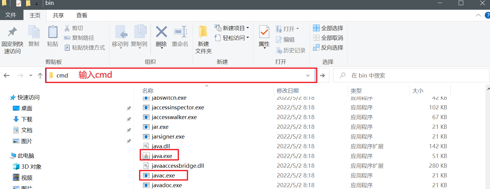

输入完cmd回车后，会出现一个黑窗口，专业说法叫**命令行窗口**


2. 第二步：在命令行窗口中输入 `javac -version`回车，然后输入`java -version`回车

   如果出现下面红色框框的提示正确版本号，和我们安装的JDK版本号一致，就说明JDK安装成功


做完以上步骤之后，恭喜小伙伴^_^，你的电脑上就已经有Java的开发环境了，接下来可以开发Java程序了。

### 2.2 cmd常见命令

前面测试JDK是否安装成功，需要在黑窗口中输入`javac -version`和`java -version` 这其实就是JDK查看编译工具和运行工具版本号的命令。

这种输入命令的和电脑交互的方式，称之为命令行交互。也就是说，可以使用命令指挥电脑做事情。接下来我们了解几种Windows系统常见的命令，后面可能会用到。

下面是Windows系统常见的命令以及作用，小伙伴们可以自己试一试。需要注意的是，每敲完一条命令之后，马上敲回车就表示执行这条命名。

```java
E:  //切换到E盘
cd [目录]        //进入指定的目录
cd ..         //退回到上一级目录
cd /         //退回到根目录
dir             //显示当前目录下所有的内容
cls             //清空屏幕
```


### 2.3 Java入门程序

上一节我们已经安装好了JDK，接下来，我们就正式开始开发第一个入门Java程序。按照国际惯例，学习任何一本编程语言第一个案例都叫做 **Hello World**，意思是向世界问好，从此开用程序和世界沟通的大门。

> **编写Java程序的步骤**

编写一个Java程序需要经过3个步骤：**编写代码，编译代码，运行代码**


- [x] 编写代码：任何一个文本编辑器都可以些代码，如Windows系统自带的记事本
- [x] 编译代码：将人能看懂的源代码（.java文件）转换为Java虚拟机能够执行的字节码文件（.class文件）
- [x] 运行代码：将字节码文件交给Java虚拟机执行

----

> **编写第一个Java入门程序**

按照下面提供的步骤，一步一步的完成第一个Java入门程序的编写、编译和执行。

**第一步**：新建一个后缀为.java的文本文件`HelloWorld.java`，用记事本编写代码如下。

```java
public class HelloWorld {
   public static void main(String[] args) {
     System.out.println(" HelloWorld ");
    }
}
```

**第二步**：进入`HelloWorld.java`文件所在目录，在地址栏输入cmd回车，即可在此处打开命令行窗口。


编译：在命令行窗口输入编译命令`javac HelloWorld`完成编译，编译后会生成一个`HelloWorld.class`文件。


**第三步**：再接着输入`java HelloWorld`就可以运行了，运行结果如下。


### 2.4 Java程序中常见的问题

刚才小伙伴们在编写第一个HelloWorld程序的时候，是不是很容易报错啊？ 我观察过第一次写代码，90%的同学都会有些小问题的，比如单词写错了！ 括号少写一个！等等！  我想给大家说的是，写错代码都是很正常的，**一个什么错都犯过的程序员，才是真正的程序员**。

下面我们把程序中常见的问题，总结一下。大家在写代码时注意一下这些问题就可以了

- [x] Windows的文件扩展名没有勾选
- [x] 代码写了，但是忘记保存了
- [x] 文件名和类名不一致。
- [x] 英文大小写错误，单词拼写错误，存在中文符号，找不到main方法。
- [x] 括号不配对。
- [x] 编译或执行工具使用不当。

---

> - **文件扩展名没有打开**

下图中文件扩展名的勾勾没有勾选，就会导致你创建的文件是普通的文本文件（.txt）文件，而不是java文件。

**正确做法是把文件扩展名的勾选上**

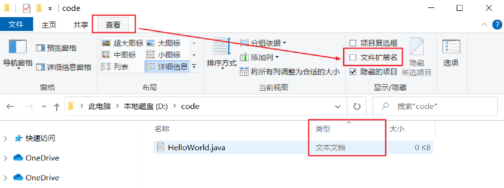

> - **文件名和类名不一致**

你看下图中，文件名是`HelloWorld`，但是类名是`Helloworld`看出区别了吗？一个是大写的W，一个是小写的w。 不仔细看还真看不出来。 

正确写法是文件名叫`HelloWorld`，类名也叫`HelloWorld`


> - **单词大小写错吴**

下图中不是string和system这两个单词都写错了， 这里是严格区分大小写的

**正确写法是String和System**

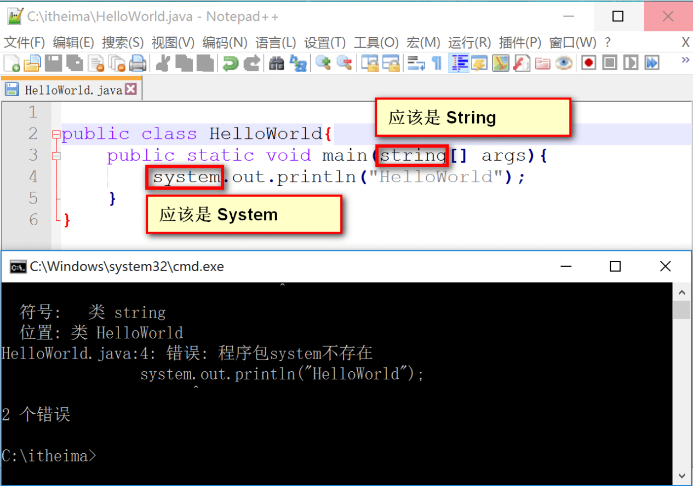


> - **主方法写错了**

下图所示，主方法的名称写成了`mian`，这是错误的。

主方法正确写法：必须是` public static void main(String[] args){}`，一个字母都不能错。


> - **标点符号写错了**

下图中打印语句最后的分号，写成功中文分号`；`

**正确写法应该是英文分号** `;`  不仔细看还真看不出区别，要小心

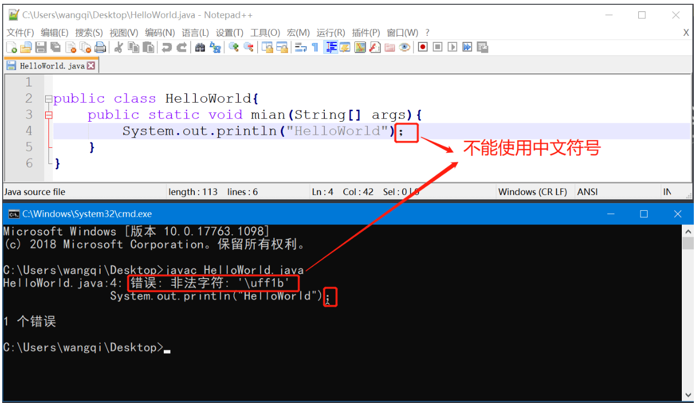

注：当JDK版本大于11时，我们可以直接使用java命令直接编译运行java文件，且不会产生class字节码文件


### 2.5 JDK的组成

在前几节课中我们已经安装了JDK，并且开发了一个Java入门程序，用javac命令编译，用Java命令运行，但是对于Java程序的执行原理并没有过多的介绍。 

下面我们把JDK的组成，以及跨平台原理给大家介绍一下，有利于同学们理解Java程序的执行过程。 

JDK由JVM、核心类库、开发工具组成，如下图所示


下面分别介绍一下JDK中每一个部分是用来干什么的

```java
- 什么是JVM?
    答：JDK最核心的组成部分是JVM（Java Virtual Machine），它是Java虚拟机，真正运行Java程序的地方。
    
- 什么是核心类库？
	答：它是Java本身写好的一些程序，给程序员调用的。 Java程序员并不是凭空开始写代码，是要基于核心类库提供的一些基础代码，进行编程。
	
- 什么是JRE?
    答：JRE（Java Runtime Enviroment），意思是Java的运行环境；它是由JVM和核心类库组成的；如果你不是开发人员，只需要在电脑上安装JRE就可以运行Java程序。
    
- 什么是开发工具呢？
	答：Java程序员写好源代码之后，需要编译成字节码，这里会提供一个编译工具叫做javac.exe，编写好源代码之后，想要把class文件加载到内存中运行，这里需要用到运行工具java.exe。 
	除了编译工具和运行工具，还有一些其他的反编译工具、文档工具等待...
```

JDK、JRE的关系用一句话总结就是：用JDK开发程序，交给JRE运行


### 2.6 Java的跨平台原理

学完JDK的组成后，我们知道Java程序的执行是依赖于Java虚拟机的。就是因为有了Java虚拟机所以Java程序有一个重要的特性叫做跨平台性。

- **什么是跨平台行呢？**

  所谓跨平台指的是用Java语言开发的程序可以在多种操作系统上运行，常见的操作系统有Windows、Linux、MacOS系统。

  

  如果没有跨平台性，同一个应用程序，想要在多种操作系统上运行，需要针对各个操作系统单独开发应用。比如微信有Windows版本、MacOS版本、Android版本、IOS版本

  

- **为什么Java程序可以跨平台呢？**

  跨平台性的原理是因为在**不同版本的操作系统**中安装有**不同版本的Java虚拟机**，Java程序的运行只依赖于Java虚拟机，和操作系统并没有直接关系。**从而做到一处编译，处处运行**。


### 2.7 JDK环境变量配置

JDK安装后，接下我们来学习一个补充知识，叫做Path环境变量

- **什么是Path环境变量？**

  Path环境变量是让系统程序的路径，方便程序员在命令行窗口的任意目录下启动程序；

- **如何配置环境变量呢？**

  比如把QQ的启动程序，配置到Path环境变量下就可以在任意目录下启动QQ，按照一下步骤操作。

  **第一步：**先找到QQ启动程序所在的目录`C:\Program Files (x86)\Tencent\QQ\Bin`，复制这个路径

  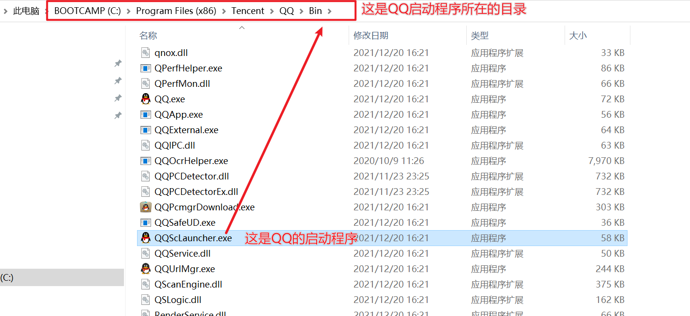

  **第二步：**按照下面的步骤，找到Path环境变量。

  首先找到此电脑，右键点击属性，可以按照下面的界面；点击【高级系统设置】，再点击【环境变量】

  

  双击Path后，点击新建，把QQ启动目录粘贴进来，不要忘记点确定哦^_^

  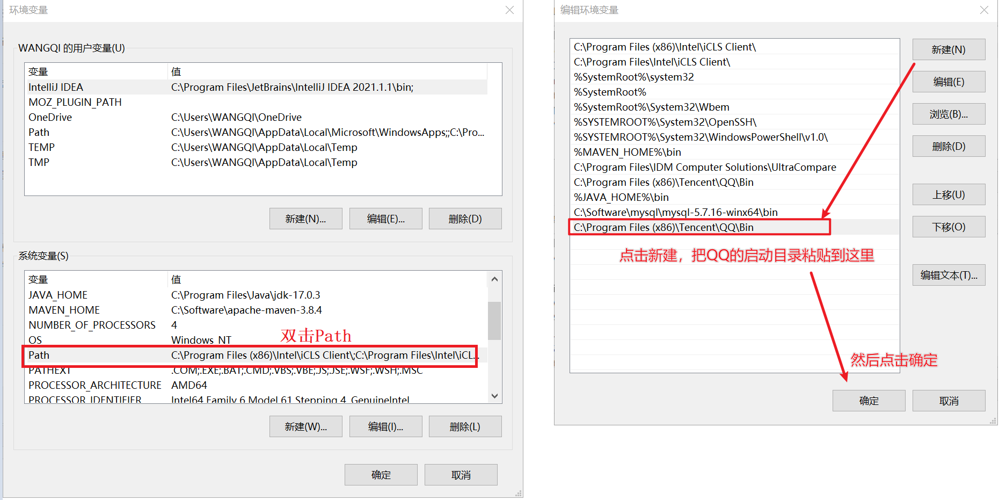

  **第三步：**配置好之后，检查是否配置成功

  ```java
  1.Win+R 输入cmd回车，打开命令行窗口
  2.输入QQScLanucher，可以看到QQ启动了
  ```

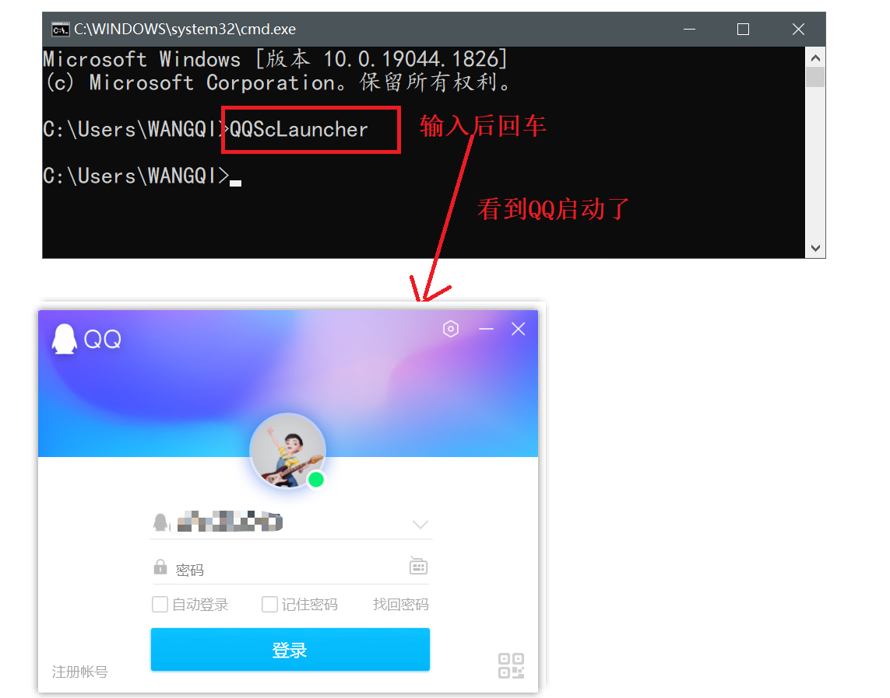

----

- **将JDK配置到Path路径下**

  上面我们配置了QQ的启动目录到Path环境变量位置，那么接下来，我们把JDK的bin目录配置到Path环境变量下，这样就可以在任意目录下启动javac和java命令来完成编译和运行了。

  **第一步：**找到JDK的bin目录`C:\Program Files\Java\jdk-17.0.3\bin`，复制一下

  **第二步：**将JDK的bin目录粘贴在Path环境变量后面

  

  

  **第三步：检测否配置成功**

  ```java
  1.按住Win+R输入cmd 回车，打开命令行创建
  2.输入javac -version 看提示信息是否显示你安装JDK的版本号
    输入java -version 看提示信息是否显示你安装JDK的版本号
  【如果显示版本号都是JDK17就表示配置安装成功】
  ```

  


你如果按照前面的操作到这里，就说明JDK环境变量已经配置好了，后面使用JDK命令可以在任意目录下运行。


## 三、Java开发工具

大家刚才写代码的时候都是用记事本写的，但是有没有觉得记事本写代码不太方便啊！记事本写代码单词写错了没有提示，格式也不好调整，写代码之后还需要我们到命令行使用javac命令手动编译，然后运行。

有没有一种软件能够将写代码、编译、运行等工具集成到一起呢？ 有，这就是集成开发环境（Integrated Development Environment ，简称IDE）。除此之外，IDEA还有代码提示、检查代码错误等功能，从而提高程序员的开发效率。

IDE有很多种，常见的Eclipse、MyEclipse、Intellij IDEA、JBuilder、NetBeans等。但是这些IDE中目前比较火的是Intellij IDEA（以下简称IDEA），被众多Java程序员视为最好用的Java集成开发环境，所以我们课程中就以IDEA为开发工具来编写代码，以后大家去公司也建议用IDEA作为开发环境。


### 3.1 IDEA下载和安装

为了引导大家正确的完成IDEA的下载和安装，给小伙伴们单独提供了一个文档《IDEA安装、使用、配置.pdf》，文档中提供了IDEA详细的安装和使用步骤，大家只需要按照文档的步骤一步一步操作就行。

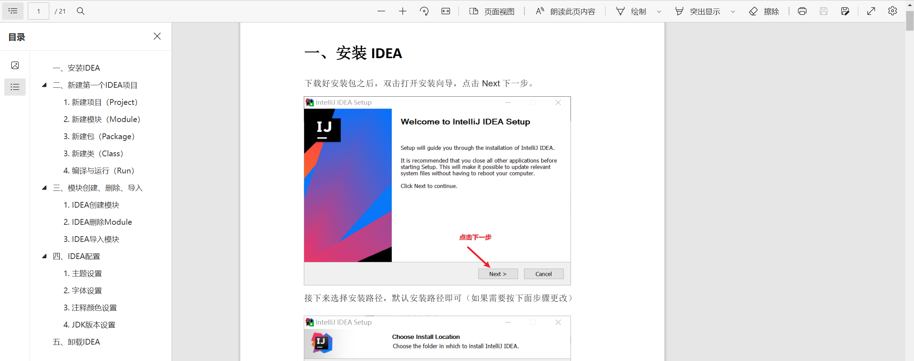


### 3.2 IDEA编写Java程序

上一节我们安装好了IDEA之后，接下来我们就可以使用IDEA开发一个HelloWorld程序玩一玩！目的是让大家知道在IDEA中开发Java程序的步骤。

想要在IDEA正确的写一个Java程序，必须先认识一下IDEA的管理Java程序的工程结构。

- 第一步：首先得在IDEA中创建一个Project（工程、也叫项目），后面统称为工程。
- 第二步：需要在Project中创建Module（模块），一个工程中可以包含多个模块
- 第三步：需要在Module中新建Package（包），一个模块中可以有多个包
- 第四步：需要在Package中新建Class（类），一个包中可以包含多个类

软件工程其实类似于建筑工程，我们对比建筑工程来理解。

- Project（工程）：你可以理解成小区的院子
- Module（模块）：你可以理解成小区院子里面的每一栋楼
- Package（包）：你可以理解成每一栋楼的一层
- Class（类）：你可以理解成每一层的住户


在实际开发中比如淘宝网站这样的工程，但是由于功能很多，所以就把淘宝网站分为不同的模块，首页是一个模块、购物车是一个模块、订单也是一个模块；


- **创建工程Project**

  创建工程的步骤比较多，在《IDEA安装、使用、配置.pdf》中提供的详细的引导步骤，照着一步一步的操作就行。

  用浏览器打开《IDEA安装、使用、配置.pdf》点击左侧的导航栏可以定位到对应的位置，每一个部分都有截图步骤

  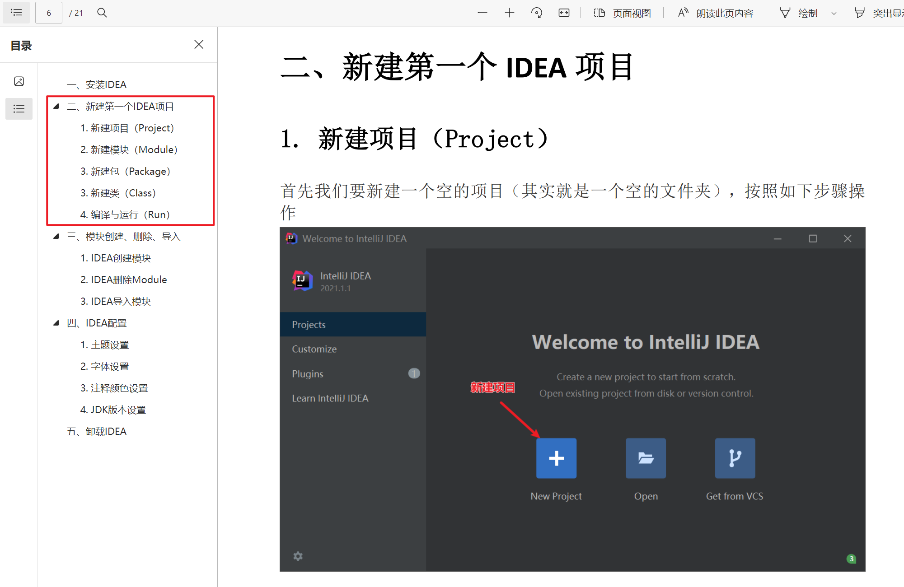


### 3.4 IDEA各种配置

刚才有同学在使用IDEA编写程序时，可能会觉得字体比较小，背景色是黑色的，注释是灰色的，看不清，长时间可能对眼睛不好。我们可以通过IDEA相关的设置，把字体调大一点，背景色调为护眼色，注释也调为绿色。

- **主题配置**


- **字体配置**


- **背景色配置**

把背景色的颜色值，调为204、238、200；就是豆沙绿的护眼色了

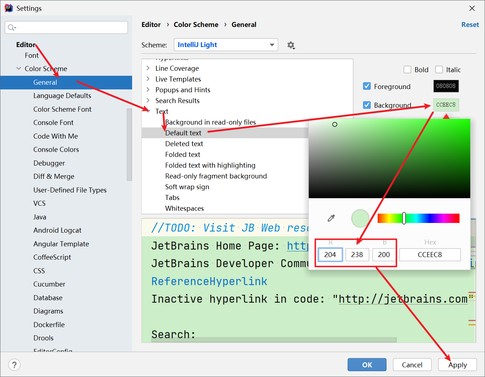

更多配置，大家可以参考《IDEA安装、使用、配置.pdf》


### 3.5 常用快捷键

讲完IDEA相关配置之后，接下来给大家讲一个很重要的IDEA的使用技巧，这就是IDEA的快捷键，所谓快捷键就是通过键盘上的按键组合起来，就可以帮我们生成代码。使用快捷键可以大大提高我们的开发效率。

下面是几种常见的快捷键，以及他们的作用，大家可以自己试试

| **快捷键**                        | **功能效果**                     |
| --------------------------------- | -------------------------------- |
| main/psvm、sout、…                | 快速键入相关代码                 |
| Ctrl + D                          | 复制当前行数据到下一行           |
| Ctrl + Y                          | 删除所在行，建议用Ctrl + X       |
| Ctrl + ALT + L                    | 格式化代码                       |
| ALT + SHIFT + ↑ , ALT + SHIFT + ↓ | 上下移动当前代码                 |
| Ctrl + / , Ctrl + Shift + /       | 对代码进行注释(讲注释的时候再说) |

快捷键其实有很多，这里列举的是现阶段我们用得比较多的，现在记住不也不要紧，以后经常用，用着用着就记住了。

在后面的课程中讲到一些新的知识点时，还有会继续给大家讲一些新的快捷键。


## 四、Java基础语法

前面讲到的所有内容，都是为Java程序开发做一些准备工作，我们还没有正式教大家如何编写代码。

想要编写Java代码，就必须学习Java的语法，学习语法最主要做到下面两点就可以了

- 记住语法格式
- 明确这种语法格式能达到什么效果

这里需要给大家说明一点：语法格式是Java语言的设计者规定好的，我们不用关心它为什么这么写，因为它造出来就是这么写的。


### 4.1 注释

我们先从最简单的语法开始学习，先来学习注释！

- 什么是注释？

  注释是解释说明程序的问题，方便自己和别人阅读代码

- 注释有哪几种？格式怎样？

  ```java
  1.单行注释：
  	//后面根解释文字
  2.多行注释
      /*
      这里写注释文字
      可以写多行
      */
  3.文档注释
      /**
      这里写文档注释
      也可以写多行，文档注释可以利用JDK的工具生成帮助文档
      */
  ```

- 下面用注释解释一段代码

  ```java
  /**
  目标：学会使用注释
       这是程序的讲解注释
  */
  public class NoteDemo{
      //这是程序的主方法，是程序的入口
      public static void main(String[] args){
          System.out.println("我开始学习Java程序，好嗨皮~~");
          /*
          窗前明月光
          疑是地上霜
          举头望明月
          低头思故乡
          */
          System.out.println("播仔");
          System.out.println("deli");
      }
  }
  ```

再多学一招：每次手动加注释比较麻烦，也可以使用快捷键加注释

```java
Ctrl + / 	        单行注释（对当前行进行注释）
Ctrl + Shift + / 	对选中的代码进行多行注释。
```


### 4.2 字面量

学习完注释之后，我们来学习一个全新的知识点叫字面量。

- 什么是字面量？

  大家不要被这个词搞晕了，它其实很简单，我们知道计算机是来处理数据的，字面量其实就是告诉程序员数据在程序中的书写格式。下面是常用的数据在程序中的书写格式


- 编写程序，在命令行打印输出各种类型的字面值

```java
/*
目标：需要同学们掌握常见数据在程序中的书写格式
*/
public class LiteralDemo{
    public static void main(String[] args){
        //1.整数
        System.out.println(666);
        
        //2.小数
        System.out.println(3.66);
        
        //3.字符: 字符必须用单引号引起来
        System.out.println('a');
        System.out.println('0');
        System.out.println('中');
        System.out.println(' '); //空格也算字符
        //特殊字符：\t表示制表符 \n表示换行
        System.out.println('\t'); //这相当于一个tab键，专业叫做制表符
        System.out.println('\n'); //这是换行的意思
        
        //4.字符串：字符串是双引号引起来的
        System.out.println("我爱你中国abc");
        
        //5.布尔值：只有两个值true和false
        System.out.println(true);
        System.out.println(false);
    }
}
```

总结一下：对于字面量，大家只要能够正确写出各种数据就可以了


### 4.3 变量

学习完字面量之后，接下来我们再来学习变量。对于变量的学习路径如下所示

1. 先认识什么是变量？

2. 学习为什么要用变量？

3. 学习变量有啥应用场景？


- **什么是变量？**

变量是用来记录程序中的数据的。其本质上是内存中的一块区域，你可以把这块区域理解成一个小盒子。

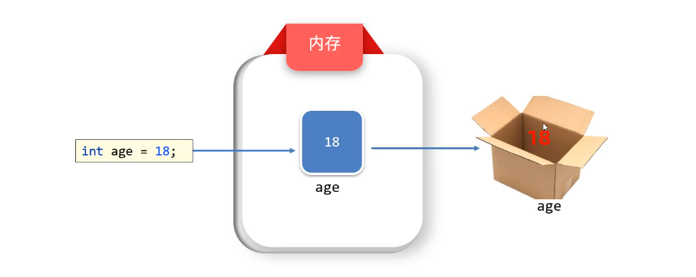

我们通过先通过一段代码演示一下，并解释变量的含义


```java
int age = 18;
System.out.println(a);
```

当执行`int age = 18;` 这句代码时，JVM会在内存中申请一块区域，在这个区域中存储了一个整数18，给这个区域取的名字叫age； 相当于在盒子中存了一个数据18，这个盒子的名字是age，当我们打印age时，就是从盒子中把盒子中的数据取出来再打印。


- **为什么要用变量呢？**

使用变量来记录数据，对于数据的管理更为灵活。比如我们有多个地方用到一个整数10,

```java
//1.假设4多个地方用到整数10; 现在我想把10改为20，这时你得一条语句一条语句的修改
System.out.println(10);
System.out.println(10);
System.out.println(10);
System.out.println(10);

//2.同样这里还是在多个地方用到整数10，你可以先用一个变量记录这个整数10
int x = 10;
//然后在需要用到整数10的地方，用x代替就行；
//如果我们把x值改了，那么后面用到x的值的地方就都一起改变了
System.out.println(x);
System.out.println(x);
System.out.println(x);
System.out.println(x);
```


- **变量有应用场景?**

变量的应用场景无处不在，只要是程序中能发生变化的数据，都可以用变量存储。比如：你微信钱包中的余额，你微信的昵称，你微信的个性签名； 余额随着你花钱是不是在变少，昵称和个性签名也可以经常修改。

```java
//比如：你现在有188.8元，一会要发100元，再收20元。
double money = 188.8;
//发100元
money = money - 100;
//再收20元
money = money + 20;
//再打印money记录的值是多少
System.out.println(money);


//再比如：公交车大人2元，小孩一元，公交车经过2站
//第一站：3个大人1个小孩上车
//第二站：1个大人1个小孩上车，请问一共上了多少人，一共收入多少钱？
//刚开始公交车箱子里没有钱，用money2表示箱子里的钱
int money2 = 0;
//刚开始公交车上也没有人，用count变量表示上车的人数
int count = 0;

//经过两站的人数：第一站3人，第二站1人，总的人数是3+1
count = 3+1;
//经过两站的钱数：
money2 = money2+3*2+1; //经过第一站后
money2 = money2+2+1; //经过第二站后

//打印人数和钱数
System.out.println(count);
System.out.println(money);
```


- **变量的注意事项**

在上节课已经给大家讲了变量的基本使用，变量在实际开发中用得特别多，关于变量使用注意事项需要给大家交代一下。

讲这些注意事项目的是让大家知道，有哪些写法是允许，有哪些写法是不允许的，能分辨对错，并知道为什么错。

```java
1.变量定义在哪个{}范围内，就只在哪个大括号内有效。变量的有效范围称之为变量的作用域
	{
		int a = 10;
		System.out.println(a); //这是是对的
	}
	System.out.println(a); //这里会出错

2.在同一个作用域内，不能有两个同名的变量
	{
		int a = 10;
		int a = 20; //这里会出错
	}
	
3.变量没有初始化只，不能直接使用
	int a; //仅仅定义了变量，但是没有初始值
	System.out.println(a); //这里会出错

4.变量可以定义在同一行
	如：int a=10, b=20; //a和b都是int类型
```


到此有关变量的所有使用方式，以及变量需要注意的问题，就学习完了。

我们再总结一下几点

- 变量是用来记录程序中的数据的，可以把变量理解成内存中的小盒子，盒子里放的东西就是变量记录的数据
- 变量的定义格式： `数据类型 变量名 = 初始值;`
- 变量记录的数据程序运行过程中是可以发生改变的：`变量名 = 值;`

----


### 4.4 关键字

学完变量之后，我们再来认识一下Java的关键字。

- **什么是关键字？**

  关键字是java语言中有特殊含义的单词。比如用int表示整数，用double表示小数，等等！

- **关键字有哪些？**

  我们学习Java的语法其本质就是学习这些关键字的含义，一共有50多个关键字，我们不是一次性把这些关键字学完，会在后续的课程中每天学一点，慢慢得你就都学会了。

| **abstract**   | **assert**       | **boolean**   | **break**      | **byte**   |
| -------------- | ---------------- | ------------- | -------------- | ---------- |
| **case**       | **catch**        | **char**      | **class**      | **const**  |
| **continue**   | **default**      | **do**        | **double**     | **else**   |
| **enum**       | **extends**      | **final**     | **finally**    | **float**  |
| **for**        | **goto**         | **if**        | **implements** | **import** |
| **instanceof** | **int**          | **interface** | **long**       | **native** |
| **new**        | **package**      | **private**   | **protected**  | **public** |
| **return**     | **strictfp**     | **short**     | **static**     | **super**  |
| **switch**     | **synchronized** | **this**      | **throw**      | **throws** |
| **transient**  | **try**          | **void**      | **volatile**   | **while**  |

- **如何识别那些单词是关键字？**

现在我们不用知道这些关键字是什么意思，主要能够根据特点识别那些是关键字就可以了

```java
关键字的特点：
	1.关键字都是小写的
	2.关键字在idea中有特殊颜色标记（如果你没有修改关键字的颜色，默认是蓝色的）
```

下图中红色框住的单词都是关键字；没有框住的单词都不是关键字


### 4.5 标志符

接下来我们学习一下标志符，所谓标志符其实就是我们自己取的名字。像前面我们取的类名，变量名其实都是标志符。

讲标志符的目的，是让大家知道取名字的规则，不能让我们随即便瞎取。有些规则是强制要求的，不遵守就会报错。还有一些规则是我们建议大家遵守的，这样取名字显得我们更加专业^_^。

```java
强制要求：必须遵守，不遵守就会报错
	1.最好是字母、数字、下划线、$组成
	2.不能以数字开头
	3.不能是Java的关键字

建议遵守：按照下面的方式取名字会显得更加专业
	1.所有的名字要见名知意，便于自己和别人阅读
		举例： class Student{} //一看这个类就知道表示一个学生
			  int age =10;    //一看这个变量就知道表示年龄
		
	2.类名：首字母大写（大驼峰命名）
		举例： class Student{}
		
	3.变量名：第二个单词开始首字母大写（小驼峰命名）
		举例： double money = 6.88;  
			  double applePrice = 7.5; 
```

---

到此，恭喜小伙伴们，今天所有的内容就学习完了，加油奥利给！！！

