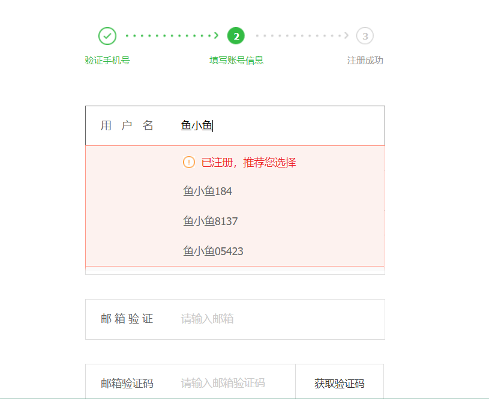

#                                   day07

## 题目1


```
如图所示:有四名学生参加注册会计师考试,表格中记录的是4名学生的考试成绩,请按照成绩将四名学生从小到大进行排名,并将结果展示出来.
```

### 训练目标 

```
Comparator,增强for,Collections
```

### 训练提示

```
1.利用Comparator接口进行排序
```

### 参考方案

```
1.将学生对象存到集合中
2.使用Collections的sort方法,进行排序
  参数为Comparator的实现类对象
  第一个参数的分数值减去第二个参数的分数值就是按照分数的从小到大排列
```

### 操作步骤

```
1.定义一个学生类,定义id(学号),name(姓名),score(分数),提供对应的get/set,以及构造方法
2.定义测试类
    2.1.定义一个ArrayList集合 list
    2.2.创建4个学生对象
    2.3.调用add方法将4个方法存到list集合中
    2.4.利用Collections中的sort方法将4个学生按照考试成绩进行排序
    2.5.遍历集合,将属性值输出出来
```

### 参考答案

```java
//学生类
public class Student {
    private int id;
    private String name;
    private int score;

    public Student() {
    }

    public Student(int id, String name, int score) {
        this.id = id;
        this.name = name;
        this.score = score;
    }

    public int getId() {
        return id;
    }

    public void setId(int id) {
        this.id = id;
    }

    public String getName() {
        return name;
    }

    public void setName(String name) {
        this.name = name;
    }

    public int getScore() {
        return score;
    }

    public void setScore(int score) {
        this.score = score;
    }
}
```

```java
//测试类
public class Test01 {
    public static void main(String[] args) {
        //1.定义一个ArrayList集合 list
        ArrayList<Student> list = new ArrayList<>();
        //2.创建4个学生对象
        Student s1 = new Student(1, "小亮", 99);
        Student s2 = new Student(2, "小勇", 85);
        Student s3 = new Student(3, "小响", 90);
        Student s4 = new Student(4, "小强", 89);
        //3.调用add方法将4个方法存到list集合中
        list.add(s1);
        list.add(s2);
        list.add(s3);
        list.add(s4);

        //4.利用Collections中的sort方法将4个学生按照考试成绩进行排序
        Collections.sort(list, new Comparator<Student>() {
            @Override
            public int compare(Student o1, Student o2) {
                return o1.getScore()-o2.getScore();
            }
        });

        //5.遍历集合,将属性值输出出来
        for (Student student : list) {
            System.out.println(student.getId()+"..."+student.getName()+"..."+student.getScore());
        }
    }
}

```

### 视频讲解

```
另附avi格式视频.
```

## 题目2


```
彩票双色球规则：双色球每注投注号码由6个红色球号码和1个蓝色球号码组成。红色球号码从1~33中选择；蓝色球号码从1~16中选择；请结合集合所学知识，随机生成一注双色球号码，要求同色号码不重复。
```

### 训练目标

```
HashSet,增强for,ArrayList,Collections
```

### 训练提示

```
1.由于6个红色球,号码不能重复,所以可以利用HashSet存储
2.排序由于Collections中的sort不能对set集合进行排序,所以,可以将HashSet中的号码放到ArrayList集合中
```

### 参考方案

```
1.创建HashSet存储6个不同的红色球号码
2.遍历HashSet集合,将每一个元素保存到ArrayList集合中,再用Collections的sort方法对ArrayList集合进行排序
```

### 操作步骤

```
1.创建Random随机数对象
2.创建HashSet用于保存不重复的红球
3.循环判断红球数量是否小于6个
4.球数量小于6个就产生一个红球.添加到HashSet中
5.如果产生重复号码，往HashSet里添加不进去，所以会再次生成号码
6.创建ArrayList集合
7.排序
8.再生成一个蓝球
9.打印中奖号码
```

### 参考答案

```java
public class Test02 {
    public static void main(String[] args) {
        // 1.创建Random随机数对象
        Random ran = new Random();
        // 2.创建HashSet用于保存不重复的红球
        HashSet<Integer> hs = new HashSet<>();
        // 3.循环判断红球数量是否小于6个
        while (hs.size() < 6) {
            // 4.球数量小于6个就产生一个红球.添加到HashSet中
            // 5.如果产生重复号码，往HashSet里添加不进去，所以会再次生成号码
            int num = ran.nextInt(33) + 1;
            hs.add(num);
        }

        //6.创建ArrayList集合
        ArrayList<Integer> list = new ArrayList<>();
        for (Integer element : hs) {
            list.add(element);
        }
        //7.排序
        Collections.sort(list);

        // 8.再生成一个蓝球
        int blueBall = ran.nextInt(16) + 1;
        // 9.打印中奖号码
        System.out.println("双色球中奖号码:");
        System.out.print("红球是: ");
        for (Integer redBall : list) {
            System.out.print(redBall + " ");
        }
        System.out.println();
        System.out.println("蓝球是: " + blueBall);
    }
}
```

### 视频讲解

```
另附avi格式视频.
```


## 题目3



```
如图所示:当我们在京东注册新用户的时候,我们输入一个要注册的用户名,如果之前有该用户名注册过,京东是不会让相同的用户名注册的,会注册失败.根据以上描述,设计程序,完成注册功能!
```

### 训练目标

```
HashSet
```

### 训练提示

```
1.输入用户名和密码之后,如果集合中有该用户,直接显示"注册失败"
2.如果集合中没有该用户,直接显示"注册成功"
```

### 参考方案

```
1.创建一个存放User对象的HashSet集合,为了保证User对象唯一,需要重写hashCode和equals方法
2.键盘录入要注册的用户名和密码,封装成User对象
3.调用HashSet中的add方法,如果返回为true,证明集合中没有重复的,直接添加,显示"注册成功!"
  如果返回的是false,证明集合中有重复的,直接显示"注册失败!"
```

### 操作步骤

```
1.定义User类,定义属性username(用户名)和password(密码),提供对应的构造以及get/set方法
2.创建测试类
  2.1.创建HashSet对象
  2.2.创建Scanner对象
  2.3.创建一个对象,将输入的用户名和密码封装成User对象
  2.4.添加到set集合,如果add返回的是true,证明可以添加,集合中没有重复的元素
      否则add方法返回false,证明不可以添加,集合中有重复的元素
```

### 参考答案

```java
//User类
public class User {
    private String username;
    private String password;

    public User() {
    }

    public User(String username, String password) {
        this.username = username;
        this.password = password;
    }

    public String getUsername() {
        return username;
    }

    public void setUsername(String username) {
        this.username = username;
    }

    public String getPassword() {
        return password;
    }

    public void setPassword(String password) {
        this.password = password;
    }

    @Override
    public String toString() {
        return "User{" +
                "username='" + username + '\'' +
                ", password='" + password + '\'' +
                '}';
    }

    @Override
    public boolean equals(Object o) {
        if (this == o) return true;
        if (o == null || getClass() != o.getClass()) return false;
        User user = (User) o;
        return Objects.equals(username, user.username) &&
                Objects.equals(password, user.password);
    }

    @Override
    public int hashCode() {
        return Objects.hash(username, password);
    }
}
```

```java
//测试类
public class Test {
    public static void main(String[] args) {
        //1.创建HashSet对象
        HashSet<User> set = new HashSet<>();
        //2.创建Scanner对象
        Scanner scanner = new Scanner(System.in);
        while(true){
            System.out.println("请输入用户名:");
            String username = scanner.next();
            System.out.println("请输入密码：");
            String password = scanner.next();
            //3.创建一个对象,将输入的用户名和密码封装成User对象
            User user = new User(username, password);
            /*
              4.添加到set集合,如果add返回的是true,证明可以添加,集合中没有重复的元素
                否则add方法返回false,证明不可以添加,集合中有重复的元素
             */
            if(set.add(user)){
                System.out.println("注册成功...");
                System.out.println("当前的用户有："+ set);
            }else{
                System.out.println("注册失败...");
            }
        }

    }
}
```

### 视频讲解

```
另附avi格式视频.
```

