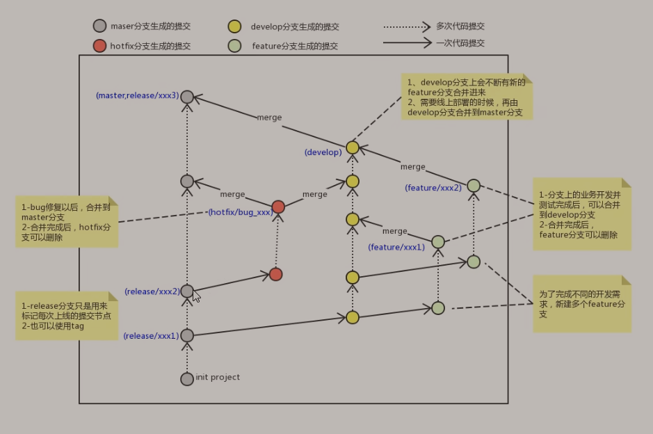

# Git

### 1.概述

##### 1.1 开发中的实际场景

* 备份
* 代码还原
* 协同开发
* 追溯问题代码编写人与编写时间

##### 1.2 版本控制器的方式

* 集中式版本控制工具 如 SVN，CVS 必须联网 存放在中央服务器
* 分布式版本控制工具 如 **Git** 每个人的电脑都是一个完整的版本库，无需联网，各自推送修改

##### 1.3 Git特点

* 速度快
* 设计简单
* 非线性开发强力，允许并行开发多分支
* 完全式分布
* 能管理超大规模项目

### 2.Git安装与常用命令

##### 2.1 安装

安装完成后，点击鼠标右键会出现两个新选项：Git GUI Here和Git Bash Here

* Git GUI：Git提供的图形界面工具
* Git Bash：Git提供的命令行工具

###### 2.1.1 基本配置

1. 打开Git Bash

2. 设置用户信息

   git config --global user.name "iWyh2"

   git config --global user.email "746879542@qq.com"

3. 查看配置

   git config --global user.name

   git config --global user.email

4. 为常用指令设置别名

   在c盘系统用户目录下，创建.bashrc文件

   命令行指令：`touch ~/.bashrc`

   在这个文件中输入特定内容，CSDN一搜一大把

##### 2.2 Git Bash中用到的一些Linux指令

* ls/ll 查看当前文件夹
* cat 查看文件内容
* touch 创建文件
* vi vi编辑器 可用其他编辑器
  * 对于Git的命令行，vi编辑器通过键盘上的insert（INS）键进行编辑，ESC键退出编辑，（：wq）保存并退出vi编辑器

##### 2.3 获取本地仓库

1. 电脑任意位置创建一个空目录作为本地仓库
2. 进入这个目录，右键打开Git Bash
3. 执行指令 git init
4. 创建成功会看到.git目录

##### 2.4 基础操作指令

Git工作目录下对文件的增删改，会修改几个状态，这些状态会随着执行的git指令变化而变化

1. `git add `：从工作区(unstaged untracked)到暂存区(staged),

   一般是 `git add 单个文件名` 也可以是通配符 `git add .`，表示所有文件都add

2. `git commit`：从暂存区到本地仓库(Repository)，格式是

   `git commit -m"注释内容"`，必须要有注释

3. `git status`：查看修改的状态

4. `git log`：查看提交日志，格式为

   `git log [option]`

   options：

   ​	`--all`：显示所有分支

   ​	`--pretty=oneline`：将提交信息显示为一行

   ​	`--abbrev-commit`：使得输出的commitId更简短

   ​	`--graph`：以图的形式展示

   创建的.bashrc文件中给这个指令起了别名：

   `git-log` 直接显示以上四种效果

   git log当查询有很多记录的仓库时，需要不断ENTER显示，最后结束要输入（q）退出这个查询界面

5. `git reset --hard commitID`：版本回退或版本切换，

   commitID用`git-log`或`git log`查看

6. `git reflog`：查看已经删除的记录

##### 2.5 添加文件至忽略列表

一些文件无需纳入Git管理 则创建一个文件 为`.gitignore`

然后在这个文件中编写“正则表达式” 指出哪些文件不需要添加被忽略即可

### 3.分支

几乎所有版本控制系统都以某种形式支持分支，使用分支意味着可以把你的工作从开发主线上分离开来进行重大BUG修改，开发新功能等，以免影响主线开发。

`HEAD ->`指向当前分支

##### 3.1 分支操作

3.1.1 查看本地分支

* 命令：`git branch`

3.1.2 创建本地分支

* 命令：`git branch 分支名`

3.1.3 切换分支

* 命令：`git checkout 分支名`

* 切换到一个不存在的分支，创建并切换：

  `git checkout -b 分支名`

3.1.4 合并分支

一个分支上的提交合并到另一个分支

* 命令：`git merge 分支名`

  合并的快进模式：当master和要合并的分支相差一个提交记录，则合并时会进行快速模式，为Fast-forward

3.1.5 删除分支

注：不能删除当前分支 只能删除其他分支

* 命令：`git branch -d 分支名`删除分支时需要各种检查
* 命令：`git branch -D 分支名`无需检查强制删除

##### 3.2 解决冲突

当两个以上的分支对文件的修改可能会存在冲突，例如同时修改了同一个文件的同一行，这需要手动解决冲突

1. 处理文件中冲突的地方，达成协议，修改还是删除
2. add
3. commit

##### 3.3 开发中的分支使用原则和流程

* master分支（生产）

  线上分支 主分支 中小规模项目作为线上运行的应用对应的分支

* develop分支（开发）

  从master创建的分支，一般作为开发部门的主要开发分支，开发完成后合并到master分支

* feature等分支

  从develop创建的分支，一般用于同期并行开发，但不同期上线的分支，完成后合并到develop分支

* hotfix等分支

  从master派生出来的分支，作为线上BUG修复使用，修复完后合并到master，test，develop等分支

### 4.Git远程仓库

##### 4.1 常用的托管服务(远程仓库)

**GitHub**、**码云**、GitLab

###### 4.1.1 注册码云

4.1.2 配置SSH公钥

* 生成SSH公钥

  * ssh-keygen -t rsa
  * 不断回车，就算存在了公钥也会覆盖掉

* Gitee设置账户公钥

  * 获取公钥

    cat ~/.ssh/id_rsa.pub

  * Gitee网址点击SSH公钥，粘贴公钥上去，起名确定

  * 验证是否配置成功

    ssh-T git@gitee.com

##### 4.2 操作远程仓库

###### 4.2.1 添加远程仓库

此操作是先初始化本地库，然后于已创建的远程库进行对接

* `git remote add 远端名称 仓库路径`
  * 远端名称：默认设置为origin，取决于远端服务器的设置
  * 仓库路径：从远端服务器获取的URL 如：从Gitee上的仓库中，点击SSH会出现路径，复制即可

###### 4.2.2 查看远程仓库

* `git remote`

###### 4.2.3 推送到远程仓库

* `git push -f --set-upstream 远端名称 本地分支名:远端分支名`

  * 远端分支名与本地分支名相同则只写本地分支名

    `git push origin master`

  * --set-upstream 推送到远端的同时并建立起和远端分支的关联关系

    `git push --set-upstream origin master：master`

  * 如果当前分支已经和远端分支关联，则可以省略分支名与远端名

    `git push`

  * `-f` 为强制覆盖

然后就可以在网站上看见自己写的文件了

###### 4.2.4 本地分支与远端分支的关联关系

* 查看关联关系：`git branch -vv`

###### 4.2.5 从远程仓库克隆

有一个远程仓库，则可以直接克隆到本地

* `git clone 仓库路径 本地目录`
  * 本地目录可省略 会自动生成 但推荐自定义目录
  * 仓库路径看上文
* 克隆过来的仓库，要进入这个仓库目录才能对其操作

###### 4.2.6 从远程仓库抓取和拉取

远程仓库和本地分支一样，我们可以进行merge合并分支操作，但需要先把远程仓库的更新下载到本地，再进行操作

* 抓取：

  `git fetch remote name branch name`

  抓取就是将仓库的更新都抓取到本地，不会进行合并

* 拉取：

  `git pull remote name branch name`

  拉取是将远端仓库的修改拉到本地并自动进行合并，等同于fetch+merge

  不指定远端名称和分支名 则抓取所有并更新当前分支

###### 4.2.7 解决合并冲突

A B两个用户修改了同一个文件的同一行，此时会发生合并冲突。

因为推送到远程仓库要先拉取远程仓库的提交，经过合并才能推送到远端分支。

远端分支也是分支，所以合并时的冲突的解决方式和本地的分支冲突相同。

### 5.IDEA中使用Git

##### 5.1 IDEA配置Git

只要你下载了GIt，一般IDEA会自动检测，到设置->版本控制->Git中查看

##### 5.2 IDEA操作Git

场景：你写了一个项目，但不是git里面的项目，又想将这个项目上传到GitHub/Gitee。

###### 5.2.1 创建项目的远程仓库

###### 5.2.2 将托管平台上的SSH地址复制到IDEA粘贴创建远端分支

###### 5.2.3 提交 推送即可